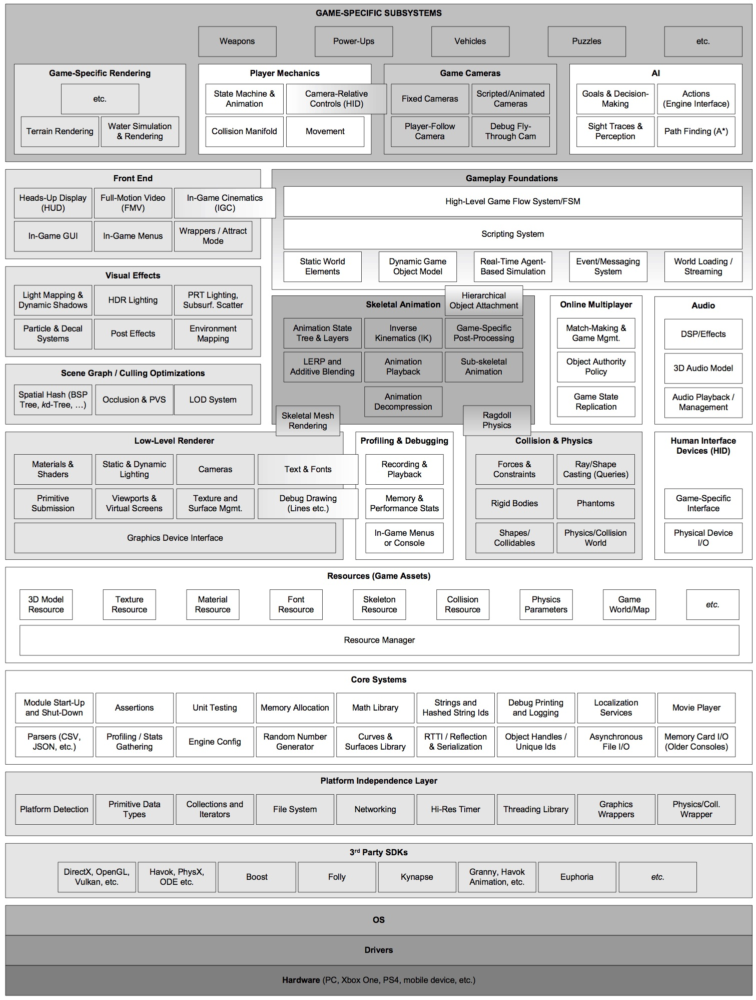

# Toon Engine 

[](https://app.codacy.com/app/Snowapril/ToonEngine?utm_source=github.com&utm_medium=referral&utm_content=Snowapril/ToonEngine&utm_campaign=Badge_Grade_Dashboard)
[](https://www.gnu.org/licenses/gpl-3.0)

## Start build (Not work yet..)

### Clone
```
git clone https://github.com/Snowapril/ToonEngine.git --recursive
git lfs pull
```

### Build 
```
mkdir Build
cd Build
cmake ../ToonEngine -G "<Enter the IDE what you want>"

example ) cmake ../ToonEngine -G "Visual Studio 16 2019"
```

## Plan Ahead



* Core Systems
	- ~~module start-up and shut-down~~
	- ~~assertions~~
	- unit testing
	- ~~memory allocation~~
	- math library
	- ~~strings and hashed string ids~~
	- ~~Debug printing and logging~~
	- localization
	- movie player
	- ~~parsers (JSON, ini ...)~~
	- profiling, stats gathering
	- engine config
	- random number generation
	- curves & surfaces library
	- RTTI / Reflection & Serialization
	- Objects handles / Unique ids
	- Asynchronous File I/O
	- Memory card I/O (older consoles) 